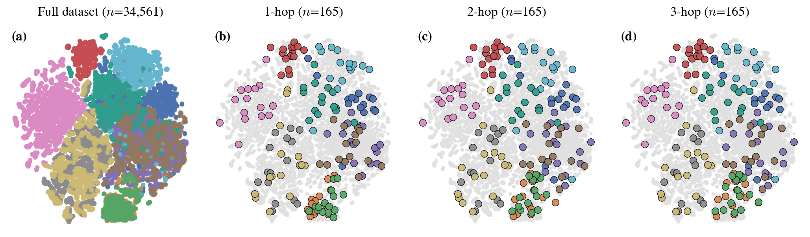
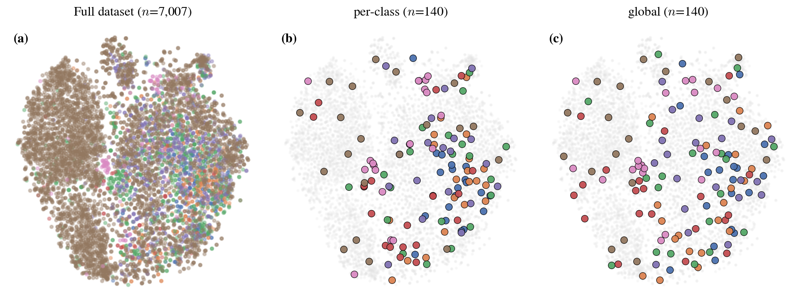

# One-Shot Data Selection for Medical Image Classification via Graph Coverage

Selecting the most informative samples to annotate from large medical image datasets, without requiring any model training. We build a neighborhood graph over pretrained image representations and use multi-hop connectivity to measure how well a small subset covers the full dataset. Samples are selected greedily to maximize this coverage, ensuring the chosen subset captures the underlying structure of the data.

<p align="center">
  
</p>

## Setup

```bash
pip install torch torchvision medmnist numpy pandas scikit-learn scipy tqdm faiss-gpu
```

## Usage

```bash
# Run selection + evaluation
python -m graphcov.run \
    --datasets organsmnist \
    --methods graph_a2 facility fps herding random \
    --embeddings uni \
    --ratios 0.02 0.05 \
    --trials 5 -v \
    --training-paradigm iteration \
    --iterations 1000

# List available methods, datasets, embeddings
python -m graphcov.run --list-methods
python -m graphcov.run --list-datasets
python -m graphcov.run --list-embeddings

# Ablation: compare k values
python -m graphcov.run.compare_k \
    --dataset organsmnist \
    --method graph_a2 \
    --embedding uni \
    --k-values 5 10 20 \
    --ratio 0.02 --train --trials 3

# Ablation: compare global vs per-class graph
python -m graphcov.run.compare_global \
    --dataset organsmnist \
    --method graph_a2 \
    --embedding uni \
    --ratio 0.02 --train --trials 3
```

## Methods

**One-shot (embedding-based):**
- `graph_a1` ... `graph_a5` — Graph kernel coverage (1-hop to 5-hop)
- `facility` — Greedy facility location on cosine similarity
- `fps` — Farthest point sampling
- `herding` — Iterative mean-matching

**Training-based:**
- `eva` — Error variability across epochs
- `el2n_top` — Error L2-norm scoring
- `forgetting` — Forgetting event counting

## Key Arguments

| Argument | Description |
|----------|-------------|
| `--datasets` | MedMNIST dataset names |
| `--methods` | Selection methods |
| `--embeddings` | `uni`, `imagenet`, `trained`, `random` |
| `--ratios` | Selection ratios (e.g., 0.02 0.05) |
| `--trials` | Number of random seeds |
| `-k` | k-NN neighbors (default: 10) |
| `--k-hops` | Propagation depth (default: 2) |
| `--global` | Global graph construction |

Results are saved to `graphcov/results/runs/<run_id>/`.

## Selection Visualizations

<p align="center">
  <br>
  <sub><b>OrganAMNIST.</b> More hops reduce redundancy: each selected sample implicitly covers a wider neighborhood, forcing the algorithm to pick from regions not yet reachable. E.g., the green and orange classes go from tightly clustered selections under 1-hop to broadly distributed under 2- and 3-hop coverage.</sub>
</p>

<p align="center">
  <br>
  <sub><b>DermaMNIST.</b> Global selection spends budget where it matters: more samples in ambiguous, overlapping regions, fewer in compact clusters already well-represented by a single pick.</sub>
</p>

## Citation

<!-- coming soon -->
